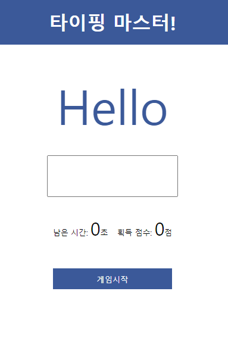

## 2021년 8월 9일
###### Vanilla 자바스크립트 타자게임 만들기
https://www.youtube.com/watch?v=_CsGSE5gwTA

 

</img>

## 게임 설명 

1. 게임 시작 버튼 클릭
2. 남은 시간 8초에서 시작(1초마다 1초씩 시간 감소)
3. 화면에 보이는 단어를 입력창에 그대로 입력
4. 화면에 보이는 단어와 입력한 단어가 같으면 점수 1점 획득(점수 제한 없음)
5. 남은 시간이 0초가 되면 alert창이 뜨면서 게임 종료 출력

## 게임 소스
index.html &nbsp;&nbsp;&nbsp;&nbsp;- 화면 구성  
css/style.css - 디자인 구성  
js/main.js &nbsp;&nbsp;&nbsp;&nbsp;&nbsp;- 동작 구성
